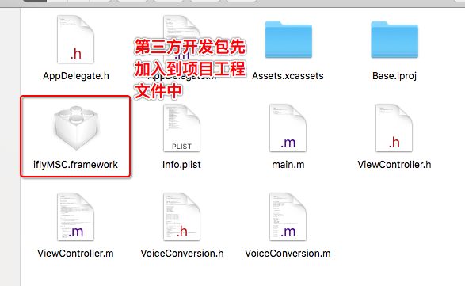
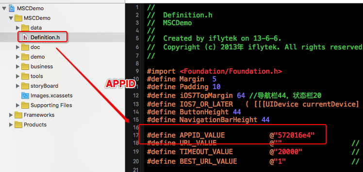
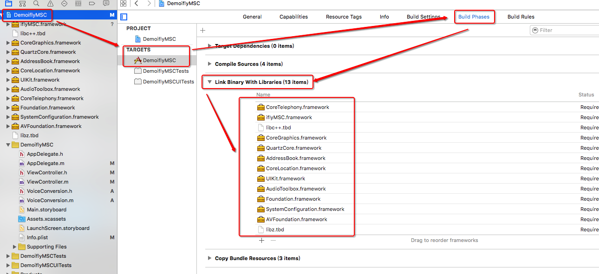
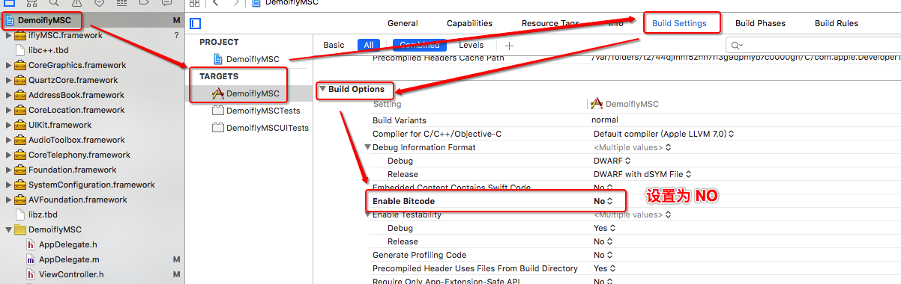

# iflyMSC_VoiceRecognizer

##科大讯飞语音识别
* 1、注册科大讯飞开发者帐号（http://www.xfyun.cn）
* 2、下载开发平台（iOS、或Android，或其他）所需要的SDK（SDK包含：说明文档、SDK即iflyMSC.framework、Demo）
* 3、项目中添加SDK（添加时，先将SDK复制粘贴到项目文件，再通过addframe的方法添加到项目引用），及相关联的framework
    * 添加方法：TARGETS-Build Phases-Link Binary With Libraries-"+"-Choose frameworks and libraries to add-add other，或选择对应的framework-add
* 4、使用时要添加对应的头文件

##特别说明：
* 1、添加科大讯飞framework，即iflyMSC.framework。


* 2、使用SDK关联的APPID存在于下载的Demo中，如果SDK有替换的话APPID应该跟着一起替换。


* 3、添加其他framework：
    * libz.tbd
    * libc++.tbd
    * CoreGraphics.framework
    * QuartzCore.framework
    * AddressBook.framework
    * CoreLocation.framework
    * UIKit.framework
    * AudioToolbox.framework
    * Foundation.framework
    * SystemConfiguration.framework
    * AVFoundation.framework
    * CoreTelephoney.framework


* 4、Bitcode属性设置为NO（TARGETS-Build Settings-Build Options-Enable Bitcode-NO）


* 5、在使用前，务必在AppDelegate的方法中进行初始化操作
```javascript
- (BOOL)application:(UIApplication *)application didFinishLaunchingWithOptions:(NSDictionary *)launchOptions 
{
    [VoiceConversion VoiceInitialize];

    return YES;
}
```

```javascript
/// 启动初始化语音程序
+ (void)VoiceInitialize
{
    // 设置sdk的log等级，log保存在下面设置的工作路径中
    [IFlySetting setLogFile:LVL_ALL];

#warning 发布时设置成NO
    // 打开输出在console的log开关（发布时，设置成NO）
    [IFlySetting showLogcat:YES];

    // 设置sdk的工作路径
    NSArray *paths = NSSearchPathForDirectoriesInDomains(NSCachesDirectory, NSUserDomainMask, YES);
    NSString *cachePath = [paths objectAtIndex:0];
    [IFlySetting setLogFilePath:cachePath];

    // Appid是应用的身份信息,具有唯一性,初始化时必须要传入Appid。初始化是一个异步过程,可放在 App 启动时执行初始化,具体代码可以参 照 Demo 的 MSCAppDelegate.m。未初始化时使用服务,一般会返回错误码 10111.
    NSString *initString = [[NSString alloc] initWithFormat:@"appid=%@", VoiceAPPID];
    [IFlySpeechUtility createUtility:initString];
}

```

* 6、需要有网络的情况下才能使用。


